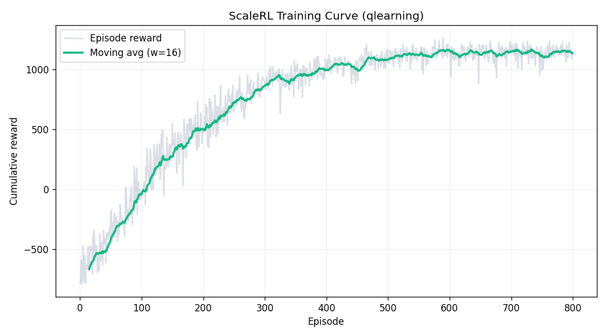
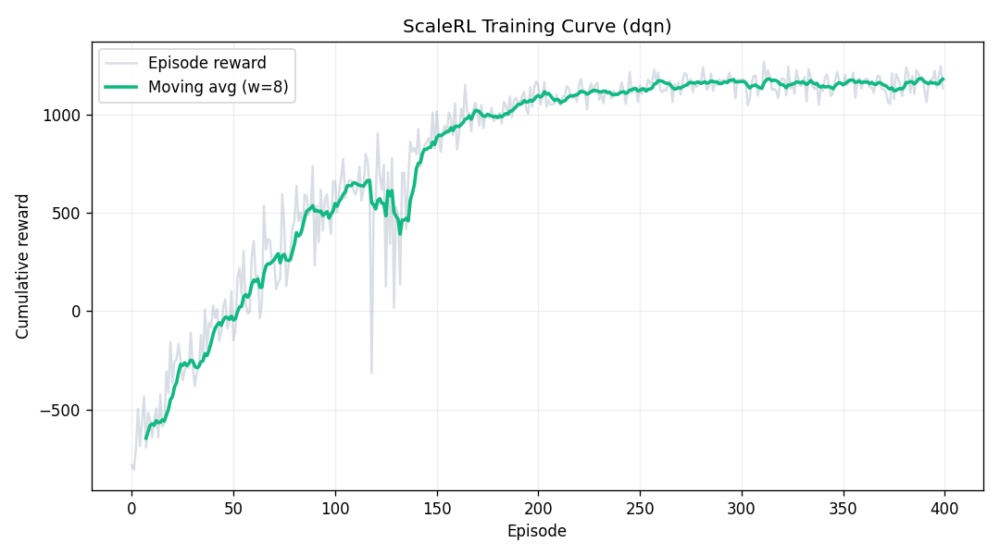
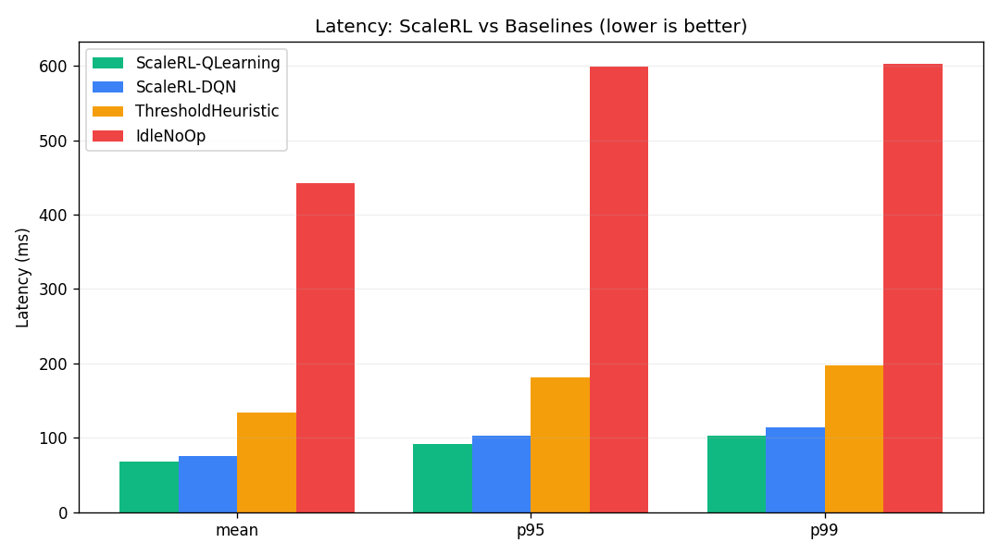

# ScaleRL

**Reinforcement-Learning cache-eviction & traffic-routing controller — trained, benchmarked, and served.**

ScaleRL models cache eviction and traffic steering on a distributed node as a
Markov Decision Process and learns a control policy that keeps latency low and
memory safe under volatile traffic. It ships as a reproducible ML pipeline:
a Gymnasium environment, two interchangeable agents (**tabular Q-learning** and
a **PyTorch DQN**), an offline training script that persists a versioned
policy, a controlled benchmark harness that *measures* results against
baselines, and a FastAPI inference gateway that serves the trained policy.

> **Note on scope.** This is a single-node RL controller on a **simulated**
> environment — a research/portfolio project, not a production distributed
> system. All performance numbers below are generated by `evaluate.py` on the
> bundled simulator — nothing is hardcoded.

---

## Why RL here

Static policies (LRU/LFU, fixed thresholds) react the same way regardless of
context. An RL agent learns *when* to intervene and *which* action to take
given the full state (latency, memory, load), trading a small action cost now
against a large latency/overflow penalty later.

The project implements **two agents behind one interface** so they can be
compared head-to-head on the identical environment:

- **Tabular Q-learning** — the state space is small, so a discretized Q-table
  gives sub-millisecond, GPU-free, fully inspectable inference.
- **DQN (PyTorch)** — an MLP Q-network with experience replay and a target
  network; generalizes across states without manual discretization and reaches
  a comparable policy in fewer environment steps.

## Architecture

```
scalerl/                 importable library
  config.py              all hyperparameters as dataclasses (reproducibility)
  env.py                 ScaleRLCacheEnv — a real gymnasium.Env
  agent.py               QLearningAgent (discretized state, save/load)
  dqn.py                 DQNAgent (Q-network, replay buffer, target net)
  normalize.py           ObservationNormalizer for the neural agent
  baselines.py           ThresholdHeuristic, Idle, LRU simulator
  experiment.py          YAML -> dataclass config loader
  tracking.py            per-run params/metrics logging (+ optional MLflow)
configs/                 declarative experiment configs (qlearning.yaml, dqn.yaml)
train.py                 offline training (--algo | --config) -> artifacts + curve
evaluate.py              controlled benchmark -> artifacts/benchmark_*.{json,csv,png}
server.py                FastAPI gateway; loads the trained policy at startup
scalerl_dashboard.html   Chart.js monitoring dashboard
tests/                   pytest suite (env, agents, baselines, config)
```

The environment is a genuine `gymnasium.Env` (`reset() -> (obs, info)`,
`step() -> (obs, reward, terminated, truncated, info)`) and passes
`gymnasium.utils.env_checker.check_env`.

## MDP formulation

**State** `[latency (ms), memory utilization (%), request volume (RPS)]`

**Actions**

| ID | Action | Effect |
| -- | ------ | ------ |
| 0 | `IDLE_STANDBY` | No intervention |
| 1 | `SOFT_EVICTION` | Drop cold tier (−15% mem, small latency cost) |
| 2 | `AGGRESSIVE_EVICTION` | Drop warm+cold tiers (−35% mem, larger cost) |
| 3 | `DYNAMIC_TRAFFIC_REROUTE` | Offload 25% of traffic to a backup node |

**Reward** balances a super-linear latency penalty, a hard penalty above 90%
memory utilization, a throughput reward, and a per-action operational cost, so
the agent is discouraged from thrashing the cache or over-rerouting.

## Quickstart

```bash
pip install -r requirements.txt

python train.py --config configs/qlearning.yaml   # -> artifacts/q_table.npy
python train.py --config configs/dqn.yaml         # -> artifacts/dqn.pt
python evaluate.py                                # benchmark all policies
pytest                                            # run the test suite

python server.py                    # serve the trained policy on :8000
# open http://localhost:8000 for the dashboard
```

Runs are declarative (YAML configs) and seeded, so they reproduce exactly.
You can also drive training from the CLI:

```bash
python train.py --algo qlearning --steps 400000 --seed 42 --track
python train.py --algo dqn        --steps 200000 --seed 42 --track
python evaluate.py --episodes 300 --seed 2024
```

`--track` writes per-run hyperparameters and metrics to `runs/<timestamp>-<name>/`
(`params.json` + `metrics.jsonl`); add `--mlflow` to mirror to MLflow if installed.

## Results

Measured by `evaluate.py` over **300 episodes** (seed `2024`). The two learned
agents were trained with the configs above (Q-learning: 400k steps; DQN: 200k
steps). Every policy is evaluated on the **same** episode seeds, so differences
reflect decisions, not luck.

| Policy | Mean latency (ms) | p95 (ms) | p99 (ms) | Mean memory (%) | Overflow steps (%) | Mean episode reward |
| ------ | -----------------: | -------: | -------: | ---------------: | -----------------: | ------------------: |
| **ScaleRL — Q-learning** | **67.4** | **91.3** | **102.2** | 10.0 | 0.0 | +1211 |
| **ScaleRL — DQN** | 75.9 | 102.5 | 114.2 | 10.3 | 0.0 | **+1230** |
| Threshold heuristic | 134.0 | 181.5 | 196.9 | 53.6 | 0.0 | −69 |
| Idle (no-op) | 442.0 | 598.6 | 602.8 | 77.5 | 69.5 | −53752 |

Both learned agents dominate the baselines: **~43–50% lower mean and p99
latency** than the hand-tuned heuristic, with **zero** memory-overflow events
(the no-op policy overflows on ~70% of steps).





### Tabular Q-learning vs DQN

A deliberate, controlled comparison rather than a claim that "deeper is better":

| Aspect | Tabular Q-learning | DQN |
| ------ | ------------------ | --- |
| Model | 13×11×11×4 Q-table (~6k cells) | 2-layer MLP, **4,676** params |
| Steps to converge | ~300k | **~150k** (better sample efficiency) |
| Best on this env | **lowest latency** (67.4 ms mean) | **highest reward** (+1230) |
| Inference | array lookup, no framework | tensor forward pass |
| Interpretability | full (inspect the table) | opaque |
| Manual tuning | needs good state binning | no discretization needed |

**Takeaway:** on a low-dimensional state space, tabular Q-learning is the
pragmatic choice — cheaper, faster, and inspectable — and here it even edges
out DQN on latency. DQN reaches a comparable (slightly higher-reward) policy in
roughly half the environment steps and needs no hand-designed bins, which is
what pays off as the state space grows. Having both behind one interface makes
that tradeoff concrete instead of hypothetical.

> **Caveat.** These results describe agent behavior *within this simulator*.
> The simulator's dynamics are a modeling choice, not measurements from real
> infrastructure; the fair takeaway is that the learned policies substantially
> outperform sensible baselines *on the same environment*.

## API

`POST /api/v1/inference`

```json
{ "latency": 115.4, "memory_utilization": 87.2, "request_volume": 4200.0 }
```

```json
{
  "action_id": 2,
  "action_name": "AGGRESSIVE_EVICTION",
  "recommendation": "High load warning. Triggering immediate core memory cleanup blocks.",
  "inference_ms": 0.03
}
```

`GET /api/v1/health` reports whether a trained policy is loaded and the
Q-table density. The gateway loads the tabular policy (`q_table.npy`) by
default; both agents expose the same `get_action` interface, so swapping in the
DQN checkpoint is a one-line change.

## Deployment

Multi-stage Docker build. The policy is **trained during the build**, so the
runtime image ships with a ready `artifacts/q_table.npy` and starts by loading
it (no in-process training):

```bash
docker build -t scalerl .
docker run -p 8000:8000 scalerl
```

## Testing & CI

33 `pytest` tests cover the env contracts (5-tuple API, bounds, determinism,
reward sign), the tabular agent (discretization bounds, Q-update math, epsilon
decay, save/load), the DQN agent (network shapes, replay buffer, normalizer,
optimization, save/load), the YAML config loader, and the baselines. GitHub
Actions runs lint + tests + a smoke train/eval + a Docker build on every push.

## Roadmap (future work)

- Prometheus `/metrics` endpoint feeding the dashboard live
- Double DQN / dueling heads and a sweep over env difficulty
- Multi-agent / shared-policy synchronization to make the "distributed" story real
